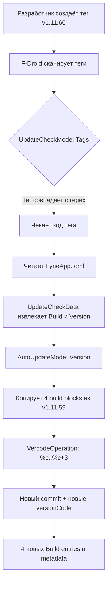

# F-Droid AutoUpdate для crocson

## Итоговый рецепт metadata/com.github.abakum.crocson.yml

```yaml
Categories:
  - Internet
License: ISC
AuthorName: Konstantin Abakumov
AuthorEmail: koka.abakum@gmail.com
SourceCode: https://github.com/abakum/crocson
IssueTracker: https://github.com/abakum/crocson/issues
Changelog: https://github.com/abakum/crocson/releases

AutoName: crocson

RepoType: git
Repo: https://github.com/abakum/crocson

Builds:
  - versionName: 1.11.59
    versionCode: 1937
    commit: 65697efb055053e0caa8b3edeb7b1288ce9b965c
    sudo: apt-get install -y golang-go
    output: crocson-arm.apk
    forceversion: true
    forcevercode: true
    prebuild:
      - sed -i 's/^Build = .*/Build = $$VERCODE$$/' FyneApp.toml
      - sed -i '/versionCode/s/="[0-9]*"/="$$VERCODE$$"/' AndroidManifest.xml
      - sed -i '/versionName/s/="[^"]*/="$$VERSION$$/' AndroidManifest.xml
    build:
      - export GOPATH=$HOME/go
      - export PATH=$GOPATH/bin:$PATH
      - git clone https://github.com/abakum/tools /tmp/tools
      - cd /tmp/tools/cmd/fyne
      - git checkout 95e3874065474636a130efaea55a13dc45907713
      - go install .
      - cd -
      - rm -rf /tmp/tools
      - fyne package -os android/arm --release
      - zip -d crocson.apk "META-INF/*" || true
      - mv crocson.apk crocson-arm.apk
    ndk: r26d

  - versionName: 1.11.59
    versionCode: 1938
    commit: 65697efb055053e0caa8b3edeb7b1288ce9b965c
    sudo: apt-get install -y golang-go
    output: crocson-arm64.apk
    forceversion: true
    forcevercode: true
    prebuild:
      - sed -i 's/^Build = .*/Build = $$VERCODE$$/' FyneApp.toml
      - sed -i '/versionCode/s/="[0-9]*"/="$$VERCODE$$"/' AndroidManifest.xml
      - sed -i '/versionName/s/="[^"]*/="$$VERSION$$/' AndroidManifest.xml
    build:
      - export GOPATH=$HOME/go
      - export PATH=$GOPATH/bin:$PATH
      - git clone https://github.com/abakum/tools /tmp/tools
      - cd /tmp/tools/cmd/fyne
      - git checkout 95e3874065474636a130efaea55a13dc45907713
      - go install .
      - cd -
      - rm -rf /tmp/tools
      - fyne package -os android/arm64 --release
      - zip -d crocson.apk "META-INF/*" || true
      - mv crocson.apk crocson-arm64.apk
    ndk: r26d

  - versionName: 1.11.59
    versionCode: 1939
    commit: 65697efb055053e0caa8b3edeb7b1288ce9b965c
    sudo: apt-get install -y golang-go
    output: crocson-386.apk
    forceversion: true
    forcevercode: true
    prebuild:
      - sed -i 's/^Build = .*/Build = $$VERCODE$$/' FyneApp.toml
      - sed -i '/versionCode/s/="[0-9]*"/="$$VERCODE$$"/' AndroidManifest.xml
      - sed -i '/versionName/s/="[^"]*/="$$VERSION$$/' AndroidManifest.xml
    build:
      - export GOPATH=$HOME/go
      - export PATH=$GOPATH/bin:$PATH
      - git clone https://github.com/abakum/tools /tmp/tools
      - cd /tmp/tools/cmd/fyne
      - git checkout 95e3874065474636a130efaea55a13dc45907713
      - go install .
      - cd -
      - rm -rf /tmp/tools
      - fyne package -os android/386 --release
      - zip -d crocson.apk "META-INF/*" || true
      - mv crocson.apk crocson-386.apk
    ndk: r26d

  - versionName: 1.11.59
    versionCode: 1940
    commit: 65697efb055053e0caa8b3edeb7b1288ce9b965c
    sudo: apt-get install -y golang-go
    output: crocson-amd64.apk
    forceversion: true
    forcevercode: true
    prebuild:
      - sed -i 's/^Build = .*/Build = $$VERCODE$$/' FyneApp.toml
      - sed -i '/versionCode/s/="[0-9]*"/="$$VERCODE$$"/' AndroidManifest.xml
      - sed -i '/versionName/s/="[^"]*/="$$VERSION$$/' AndroidManifest.xml
    build:
      - export GOPATH=$HOME/go
      - export PATH=$GOPATH/bin:$PATH
      - git clone https://github.com/abakum/tools /tmp/tools
      - cd /tmp/tools/cmd/fyne
      - git checkout 95e3874065474636a130efaea55a13dc45907713
      - go install .
      - cd -
      - rm -rf /tmp/tools
      - fyne package -os android/amd64 --release
      - zip -d crocson.apk "META-INF/*" || true
      - mv crocson.apk crocson-amd64.apk
    ndk: r26d

AutoUpdateMode: Version
UpdateCheckMode: Tags ^v[\d.]+$
VercodeOperation:
  - '%c'
  - '%c + 1'
  - '%c + 2'
  - '%c + 3'
UpdateCheckData: FyneApp.toml|Build\s*=\s*(\d+)|FyneApp.toml|Version\s*=\s*"([^"]+)"
CurrentVersion: 1.11.59
CurrentVersionCode: 1940
```

## Пояснение полей автообновления (хвост файла)

```yaml
AutoUpdateMode: Version
UpdateCheckMode: Tags ^v[\d.]+$
VercodeOperation:
  - '%c'
  - '%c + 1'
  - '%c + 2'
  - '%c + 3'
UpdateCheckData: FyneApp.toml|Build\s*=\s*(\d+)|FyneApp.toml|Version\s*=\s*"([^"]+)"
CurrentVersion: 1.11.59
CurrentVersionCode: 1940
```

## Пояснение каждого поля

### `AutoUpdateMode: Version`
- **Что делает**: Когда F-Droid находит новый релиз, автоматически создаёт новые Build entries, копируя build steps из предыдущей версии
- **Почему `Version` без паттерна**: Документация: *"If UpdateCheckMode is set to Tags, this should be set to Version without any pattern"*
- **Как работает**: Берёт ВСЕ 4 build blocks из последней версии (arm, arm64, 386, amd64), подставляет новый commit и пересчитывает versionCode через VercodeOperation

### `UpdateCheckMode: Tags ^v[\d.]+$`
- **Что делает**: F-Droid периодически сканирует git-теги репозитория
- **`^v[\d.]+$`**: Регулярка — только теги вида `v1.11.59`, `v1.11.60`. Игнорирует `v1.11.59-beta`, `v1.11.59-rc1` и т.д.
- **Триггер**: Когда находит тег новее CurrentVersion — запускает процесс автообновления

### `VercodeOperation`
```yaml
  - '%c'        # arm:     versionCode = Build
  - '%c + 1'    # arm64:   versionCode = Build + 1
  - '%c + 2'    # x86:     versionCode = Build + 2
  - '%c + 3'    # x86_64:  versionCode = Build + 3
```
- **`%c`** = значение `Build` из `FyneApp.toml` (например 1937)
- **Результат**: 4 versionCode: 1937, 1938, 1939, 1940 — точно как сейчас
- **Порядок**: arm < arm64 < x86 < x86_64 — соответствует требованию F-Droid

### `UpdateCheckData: FyneApp.toml|Build\s*=\s*(\d+)|FyneApp.toml|Version\s*=\s*"([^"]+)"`
- **Формат**: `файл_code|regex_code|файл_name|regex_name`
- **`FyneApp.toml`** — файл в корне репозитория
- **`Build\s*=\s*(\d+)`** — извлекает versionCode: `Build = 1937` → `1937`
- **`Version\s*=\s*"([^"]+)"`** — извлекает versionName: `Version = "1.11.59"` → `1.11.59`
- **Зачем**: F-Droid не умеет читать `FyneApp.toml` по умолчанию (он знает только `AndroidManifest.xml` и `build.gradle`). Это указывает ему где искать версию.

### `forcevercode: true` (в каждом build entry)
- **Что делает**: F-Droid заменяет `android:versionCode` в APK на значение из metadata
- **Зачем**: prebuild уже делает sed, но `forcevercode` — дополнительная страховка на уровне F-Droid
- **Важно**: Без этого versionCode в APK может не совпасть с ожидаемым

### `forceversion: true` (в каждом build entry)
- **Что делает**: F-Droid заменяет `android:versionName` в APK на значение из metadata
- **Зачем**: prebuild уже делает sed, но `forceversion` — дополнительная страховка на уровне F-Droid
- **Важно**: Гарантирует что versionName в APK совпадает с `versionName` в metadata

## Схема автообновления



## Что НЕ меняется автоматически

- **`git checkout 95e3874...`** — SHA tools останется тем же. Когда tools обновится — нужно вручную обновить рецепт (как и с submodule)
- **Build steps** — полностью копируются из предыдущей версии

## Файлы для изменения

| Файл | Изменения |
|------|-----------|
| `metadata/com.github.abakum.crocson.yml` | Порядок полей, forcevercode, VercodeOperation, UpdateCheckData |
| `.github/workflows/fdroid.yml` | Python-генератор: AutoUpdateMode, UpdateCheckMode, VercodeOperation, UpdateCheckData |
| `.github/workflows/fdroid4.yml` | Python-генератор: те же + ABI порядок + forcevercode |
| `.github/workflows/fyne.yml` | Python-генератор: те же + ABI порядок + forcevercode |

## Пример simplex-chat (2 ABI) для сравнения

```yaml
AutoUpdateMode: Version
UpdateCheckMode: Tags ^v[\d.]+$
VercodeOperation:
  - '%c'
  - '%c+1'
UpdateCheckData: 
  apps/multiplatform/gradle.properties|android\.version_code\s*=\s*(\d+)|apps/multiplatform/gradle.properties|android\.version_name\s*=\s*([\d.]+)
CurrentVersion: 6.5.2
CurrentVersionCode: 350
```
